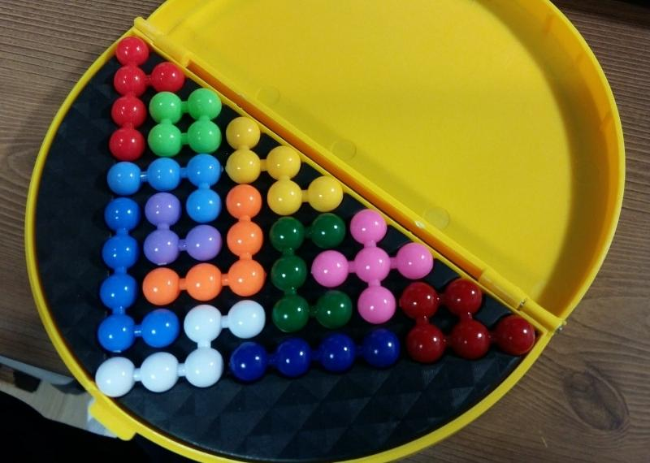

beadspuzzle
===========

Solution to my daughter's beads packing puzzle, [Goo-Seul] puzzle in Korean.
Written for python 3.5

It seems that finding all possible solutions needs
very long time (NP-complete). Thus, let user place some pieces
before this program solve() with the rest of pieces.
Of course, user can invoke solve() right away, without any placement.

Usage
-----

Command line in beadspuzzle directory
    ./beadspuzzle

Use ARROWs, ENTER, SPACE to select and place beads pieces
then 'r' to let this program solve the puzzle with the rest of the pieces.

